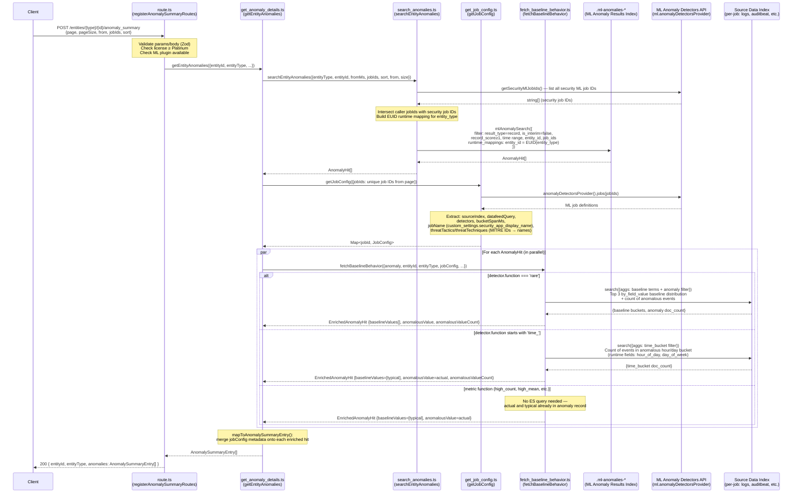
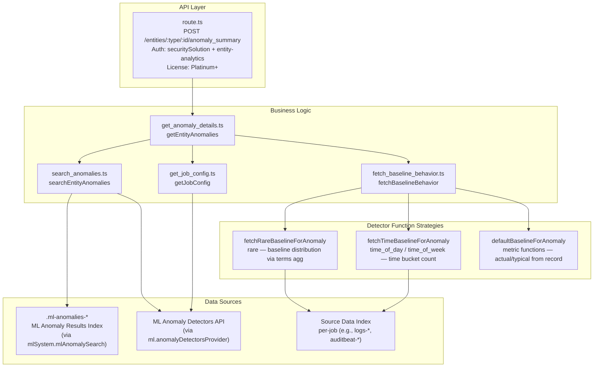

# Anomaly Summary API — Design Diagram

## Endpoint

```
POST /internal/entity_analytics/entities/{entity_type}/{entity_id}/anomaly_summary
```

**Auth:** `securitySolution` + `{APP_ID}-entity-analytics` privileges, Platinum license minimum.

---

## Request / Response Shapes

```
Request params:  entity_type (user|host), entity_id
Request body:    page, pageSize, from (epoch ms), jobIds[], sort[]
Response:        { entityId, entityType, anomalies: AnomalySummaryEntry[] }
```

---

## Sequence Diagram



---

## Component Overview



---

## Key Design Decisions

| Concern | Decision |
|---|---|
| **Pagination** | Offset-based (`page`/`pageSize` → `from`/`size` in ES query) |
| **Entity identification** | EUID runtime mapping — computes `entity_id` from raw fields at query time, no pre-indexing needed |
| **Job scoping** | Always intersects caller-supplied `jobIds` with known security ML job IDs; never exposes non-security jobs |
| **Baseline enrichment** | Parallel `Promise.all` per anomaly; failures fall back gracefully to un-enriched record |
| **Detector strategy** | Three strategies selected by `detector.function`: `rare` (occurrence), `time_*` (temporal), else metric (actual/typical passthrough) |
| **MITRE metadata** | IDs resolved to human-readable names at runtime using bundled tactics/techniques lookup maps |
| **ML plugin absent** | Returns `{ anomalies: [] }` with a warning log — no error thrown |
